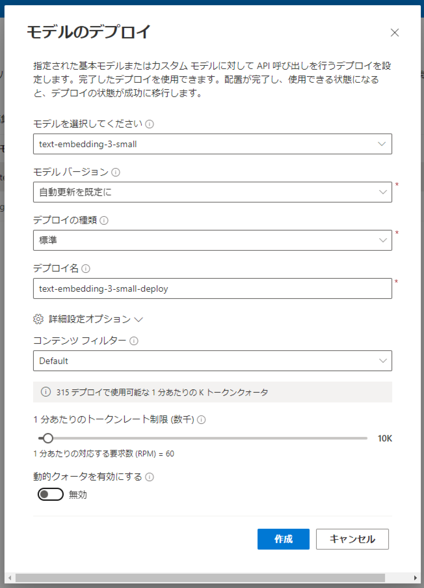

# aoai-rag-handson
# リソースの作成
./setup_resources.sh
# リソースの削除
az group delete --name rg-rag-handson

# Azure RAG Hands-On

このリポジトリは、Azure OpenAI ServiceとAzure AI Searchを使ったRAG (Retrieve and Generate) をハンズオン形式で学習するためのものです。本ガイドでは、GitHub Codespacesを利用して環境構築します。

## このハンズオンに必要なもの

- GitHubのアカウント(GitHub Codespacesの120CPU時間の無料枠利用のためFreeでOK)
- Azureのサブスクリプション
- Azureのサブスクリプションで利用可能なAzure OpenAI Service

## Azureリソースの作成
このハンズオンには、以下の2つのAzureリソースが必要です。
1. Azure OpenAI Service
2. Azure AI Search

1. **Azure OpenAI Serviceのリソース作成手順**
    - Azure Portalにアクセスします。画面上部の検索ボックスに「openai」と入力し、「Azure OpenAI」というサービスをクリックしてください。
    
    - 次に「+作成」をクリックします。
    
    - サブスクリプションを選択、リソースグループを新規作成(リソースグループ名は任意、リージョンはEast US)します。次にリージョンを選択（今回はEast US）、名前（任意）を入力し、価格レベル（Standard S0）を選択します。すべての情報を入力したら、「次へ」をクリックします。
    
    - 次にネットワークでアクセスレベルを選択します。ここでは、「インターネットを含むすべてのネットワークがこのリソースにアクセスできます。」を選択して、「次へ」をクリックします。
    
    - 次にタグを設定ですが、ここでは何も入力せずに「次へ」をクリックします。
    
    最後にレビューおよび送信で設定した情報の確認を行います。問題なければ、「作成」をクリックします。リソースの作成には数分かかる場合があります。
    

    **モデルのデプロイ**
    Azure OpenAI Serviceのリソースが作成できたら、モデルをデプロイしましょう。gptモデル、embeddingモデルの順にデプロイしていきます。
    1. gpt-35-turboモデルのデプロイ
        - さきほど作成したAzure OpenAI Serviceリソースに移動し、「モデル デプロイ」タブを開きます。「展開の管理」をクリックして、Azure OpenAI Studioに移動します。
        
        - 「+新しいデプロイの作成」をクリックします。
        
        以下の画像のとおり、入力・設定し「作成」をクリックしてモデルのデプロイを完了してください。特に、デプロイ名については間違いのないように注意してください。
        
    2. text-embedding-3-smallモデルのデプロイ
        - gptモデルのデプロイと同様に「+新しいデプロイの作成」をクリックします。以下の画像のとおり、入力・設定し「作成」をクリックしてモデルのデプロイを完了してください。デプロイ名については間違いのないように注意してください。
        

2. **Azure AI Searchのリソース作成手順**
    - 画面上部の検索ボックスに「ai」と入力し、「AI Search」というサービスをクリックしてください。
    
    - 次に「+作成」をクリックします。
    
    - サブスクリプション、リソースグループ（最初に作成したもの）を選択します。次にサービス名（任意）を入力、場所はEastUS、価格レベルは基本としてください。すべての情報を入力したら、「次：スケール」をクリックします。
    
    - 次にスケールでレプリカとパーテーションを設定します。デフォルトでレプリカ・パーテーションともに1になっていると思うので、そのまま「次：ネットワーク」をクリックします。
    
    - ネットワークの設定についても、デフォルトのままでいいので「次：タグ」をクリックしてください。
    - タグについても設定する必要はないので「次：確認および作成」をクリックしてください。
    - 入力内容を再度確認して、「作成」をクリックしてください。リソースの作成には数分かかる場合があります。

## Codespacesのセットアップ手順

1. **リポジトリのフォーク**
    - このリポジトリで「Fork」ボタンをクリックします。
    
    -「Create fork」ボタンをクリックして、フォークを完了します。
    

2. **Codespacesの作成**
    - フォークしたリポジトリに移動し、リポジトリ名の下にある「Code」ボタンをクリックします。
    
    - 「Codespaces」タブを選択し、「Create codespace on main」をクリックします。
    

3. **Codespacesの起動と初期設定**
    - Codespacesの環境が起動するのを待ちます。初回の起動には数分かかることがあります。
    - 環境が起動すると、自動的に必要な依存関係がインストールされます。これは `devcontainer.json` ファイルに指定された内容に基づいて実行されます。

4. **Jupyter Notebookの起動**
    - 左側のアクティビティバーから「Explorer」を選択し、任意のJupyter Notebookファイル（拡張子 `.ipynb`）をクリックして開きます。
    - 右上の「Run」ボタンをクリックして、Jupyter Notebookを実行できます。

